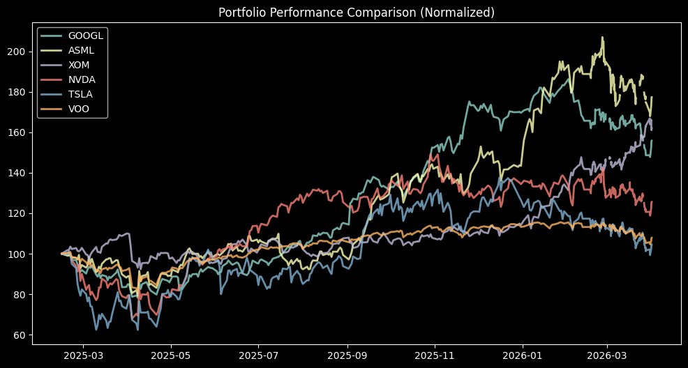

# 🧠 דוח ניתוח טכני ותחזיות הסתברותיות
עדכון: 27/02/2026 05:00

| מניה | מצב ערך | מומנטום | RSI | המלצה |
|:---|:---|:---|:---|:---|
| GOOGL | ⚪ בטווח הממוצע | 🚀 מומנטום חיובי (Golden Cross) | 43.0 | **המתנה** |
| ASML | ⚪ בטווח הממוצע | 🚀 מומנטום חיובי (Golden Cross) | 14.5 | **קנייה** |
| XOM | ⚪ בטווח הממוצע | 🚀 מומנטום חיובי (Golden Cross) | 66.2 | **המתנה** |
| NVDA | ⚪ בטווח הממוצע | 🚀 מומנטום חיובי (Golden Cross) | 11.2 | **קנייה** |
| TSLA | ⚪ בטווח הממוצע | ⚠️ מומנטום שלילי (Death Cross) | 34.2 | **המתנה** |
| VOO | ⚪ בטווח הממוצע | 🚀 מומנטום חיובי (Golden Cross) | 41.7 | **המתנה** |

