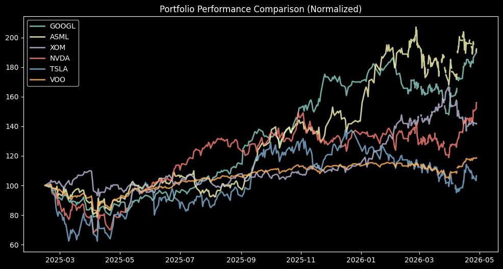

# 🧠 דוח ניתוח מפורט ותחזיות
עדכון: 08/04/2026 16:42

## 🔍 ניתוח מעמיק לפי מניה
### 📈 GOOGL
- **מצב מחיר:** ⚪ **מחיר הוגן**: המניה נסחרת סביב הממוצע ההיסטורי שלה.
- **מגמת מומנטום:** 🚀 **מגמה עולה**: הממוצע לטווח קצר מעל הארוך - המומנטום חיובי.
- **מדד עוצמה (RSI):** 87.9 - 🔥 **קניית יתר**: המניה 'חמה' מדי. ייתכן שיידרש אוורור בקרוב.

### 📈 ASML
- **מצב מחיר:** ⚪ **מחיר הוגן**: המניה נסחרת סביב הממוצע ההיסטורי שלה.
- **מגמת מומנטום:** ⚠️ **מגמה יורדת**: המומנטום נחלש, המחיר מתקשה לפרוץ למעלה.
- **מדד עוצמה (RSI):** 43.2 - ⚖️ **ניטרלי**: עוצמת הקונים והמוכרים מאוזנת.

### 📈 XOM
- **מצב מחיר:** ⚪ **מחיר הוגן**: המניה נסחרת סביב הממוצע ההיסטורי שלה.
- **מגמת מומנטום:** ⚠️ **מגמה יורדת**: המומנטום נחלש, המחיר מתקשה לפרוץ למעלה.
- **מדד עוצמה (RSI):** 27.8 - 🧊 **מכירת יתר**: פאניקה של מוכרים. לעיתים קרובות מקדים זינוק למעלה.

### 📈 NVDA
- **מצב מחיר:** ⚪ **מחיר הוגן**: המניה נסחרת סביב הממוצע ההיסטורי שלה.
- **מגמת מומנטום:** 🚀 **מגמה עולה**: הממוצע לטווח קצר מעל הארוך - המומנטום חיובי.
- **מדד עוצמה (RSI):** 67.0 - ⚖️ **ניטרלי**: עוצמת הקונים והמוכרים מאוזנת.

### 📈 TSLA
- **מצב מחיר:** ⚪ **מחיר הוגן**: המניה נסחרת סביב הממוצע ההיסטורי שלה.
- **מגמת מומנטום:** ⚠️ **מגמה יורדת**: המומנטום נחלש, המחיר מתקשה לפרוץ למעלה.
- **מדד עוצמה (RSI):** 41.7 - ⚖️ **ניטרלי**: עוצמת הקונים והמוכרים מאוזנת.

### 📈 VOO
- **מצב מחיר:** ⚪ **מחיר הוגן**: המניה נסחרת סביב הממוצע ההיסטורי שלה.
- **מגמת מומנטום:** 🚀 **מגמה עולה**: הממוצע לטווח קצר מעל הארוך - המומנטום חיובי.
- **מדד עוצמה (RSI):** 53.4 - ⚖️ **ניטרלי**: עוצמת הקונים והמוכרים מאוזנת.

## 📊 השוואת צמיחה יחסית

---
### 📔 מילון מונחים למשקיע:
- **Mean Reversion (חזרה לממוצע):** הנחה שמחיר המניה תמיד יחזור לממוצע שלו. סטייה חריגה היא הזדמנות או נורת אזהרה.
- **RSI (מדד עוצמה יחסית):** כלי שמודד את מהירות שינויי המחיר. עוזר לזהות מתי הציבור רץ לקנות/למכור בטירוף.
- **Momentum (מומנטום):** בודק אם 'הרוח בגב' של המניה. מניה במומנטום חיובי נוטה להמשיך לעלות.