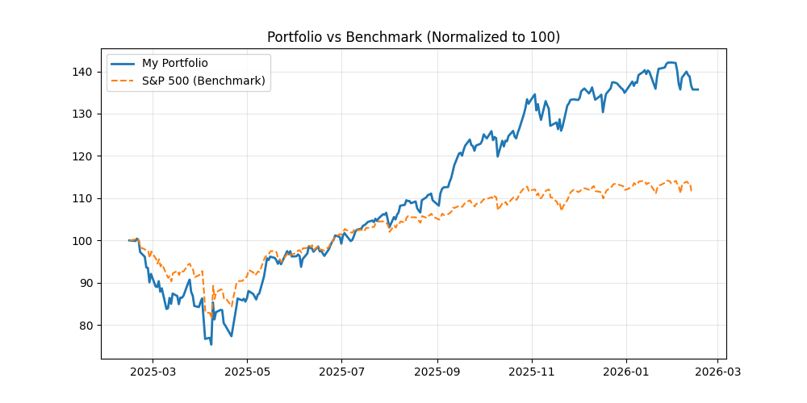
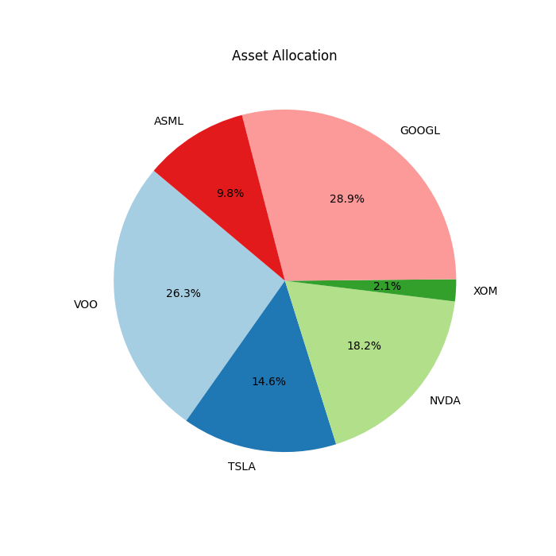

# 📊 Portfolio Dashboard
**עודכן ב:** 16/02/2026 08:31 | **שער דולר:** ₪3.085

## 💰 סיכום ביצועים כולל
- **שווי תיק:** `₪176,270`
- **תשואה מצטברת:** `+35.70%`
- **מקס' ירידה מהשיא (Drawdown):** `-24.97%`
- **מניית החודש 🚀:** ASML (+88.8%)
- **המאכזבת 📉:** VOO (+13.2%)

## 📈 גרף ביצועים

## 🥧 התפלגות נכסים

## 📊 פירוט אחזקות
| מניה | כמות | שווי (₪) | משקל בתיק |
| :--- | :--- | :--- | :--- |
| VOO | 24 | ₪46,417 | 26.3% |
| TSLA | 20 | ₪25,756 | 14.6% |
| NVDA | 57 | ₪32,144 | 18.2% |
| XOM | 8 | ₪3,663 | 2.1% |
| GOOGL | 54 | ₪50,932 | 28.9% |
| ASML | 4 | ₪17,358 | 9.8% |