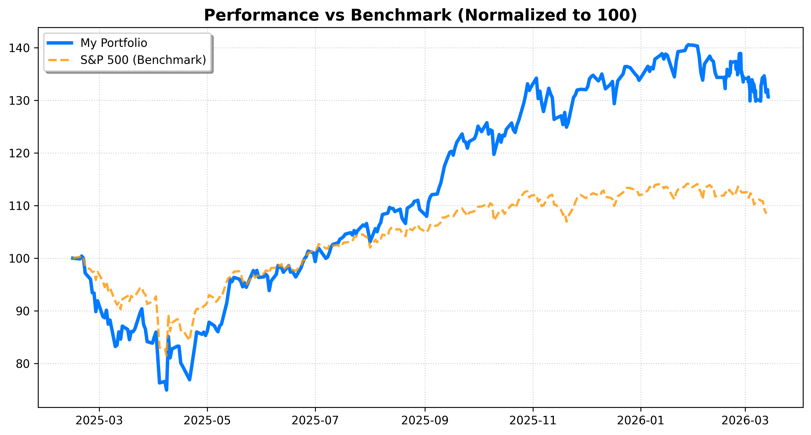
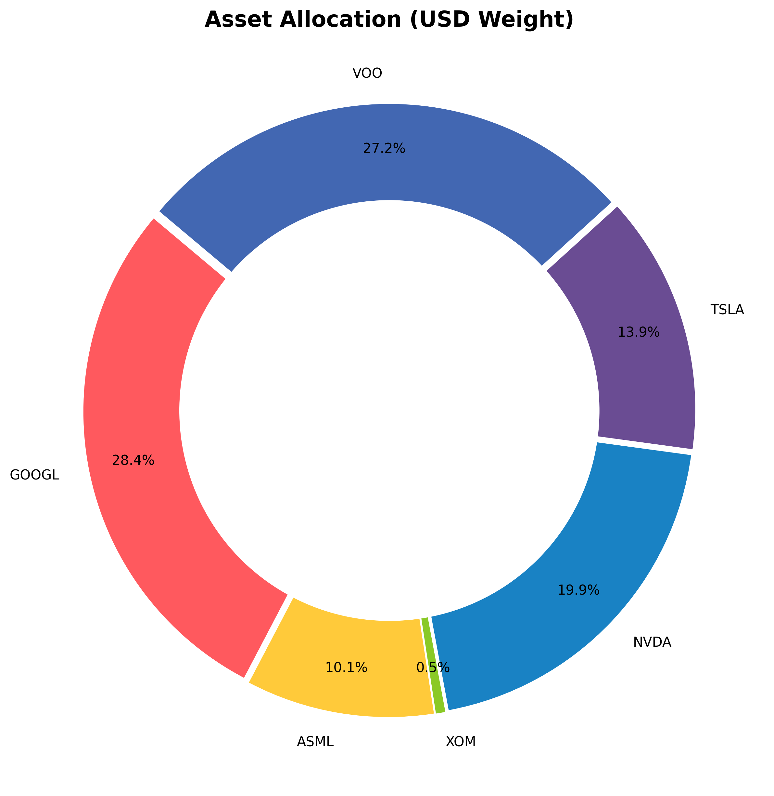

# 📊 Portfolio Dashboard
**עודכן ב:** 16/02/2026 19:47 | **שער דולר:** ₪3.092

## 💰 סיכום ביצועים כולל
- **שווי תיק:** `₪176,685`
- **תשואה מצטברת:** `+35.70%`
- **מקס' ירידה מהשיא (Drawdown):** `-24.97%`
- **מניית הכוכב 🚀:** ASML (+88.8%)
- **המאכזבת 📉:** VOO (+13.2%)

## 📈 גרף ביצועים (מול S&P 500)

## 🥧 התפלגות נכסים

## 📊 פירוט אחזקות
| מניה | כמות | שווי (₪) | משקל בתיק |
| :--- | :--- | :--- | :--- |
| VOO | 24 | ₪46,526 | 26.3% |
| TSLA | 20 | ₪25,817 | 14.6% |
| NVDA | 57 | ₪32,220 | 18.2% |
| XOM | 8 | ₪3,672 | 2.1% |
| GOOGL | 54 | ₪51,052 | 28.9% |
| ASML | 4 | ₪17,399 | 9.8% |

---
📂 *כל הנתונים והארכיון שמורים בתיקיית `data_hub`*