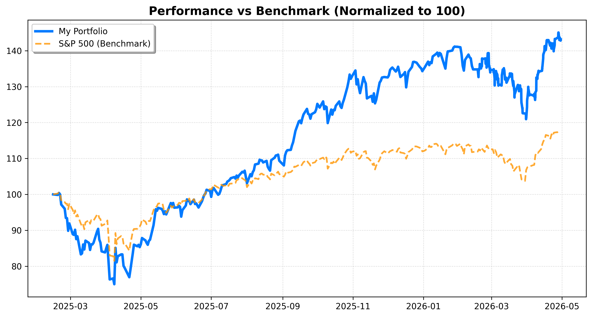
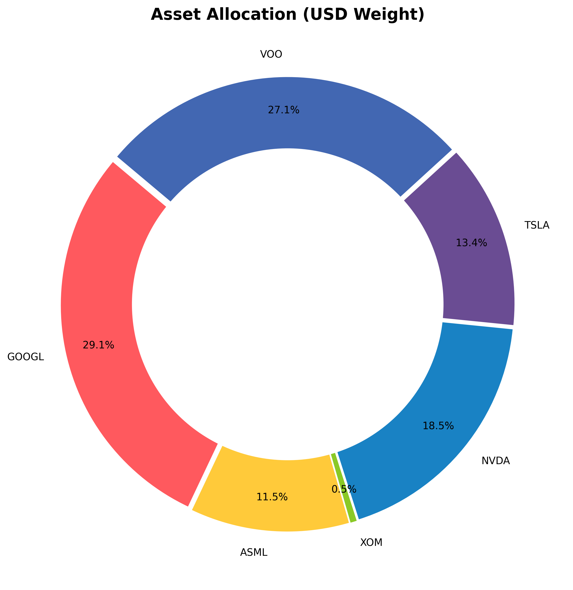

# 📊 Portfolio Dashboard | מעקב תיק השקעות
**Last Update:** 14/03/2026 00:33 | **USD/ILS:** ₪3.143

## 💰 Portfolio Summary | סיכום התיק
| Metric | Value | נתון |
| :--- | :--- | :--- |
| **Current Value** | `₪163,494` | **שווי נוכחי** |
| **Total Invested** | `₪132,008` | **סך השקעה** |
| **Total Profit/Loss** | `+23.85%` (₪31,486) | **רווח/הפסד כולל** |
| **Daily Change** | `-0.74%` | **שינוי יומי** |

## 📜 Holdings | פירוט החזקות
| Ticker | Shares | Avg. Cost | Current Price | P&L % | P&L ILS |
| :--- | :--- | :--- | :--- | :--- | :--- |
| GOOGL | 45 | $181.15 | $302.22 | 🟢 +66.83% | ₪17,124 |
| ASML | 4 | $934.51 | $1,346.91 | 🟢 +44.13% | ₪5,185 |
| XOM | 2 | $126.08 | $156.14 | 🟢 +23.84% | ₪189 |
| NVDA | 57 | $148.62 | $180.26 | 🟢 +21.29% | ₪5,669 |
| TSLA | 20 | $436.45 | $391.17 | 🔴 -10.37% | ₪-2,846 |
| VOO | 24 | $527.38 | $609.12 | 🟢 +15.50% | ₪6,166 |

## 📈 Charts | גרפים

---
📂 *Created by Almog787*