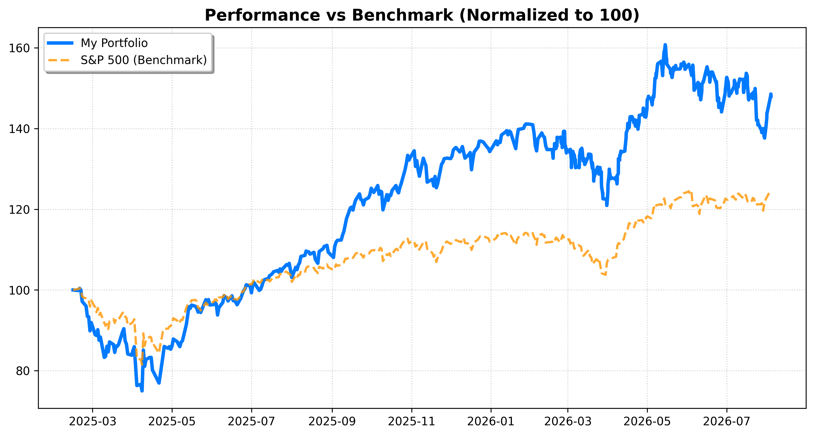
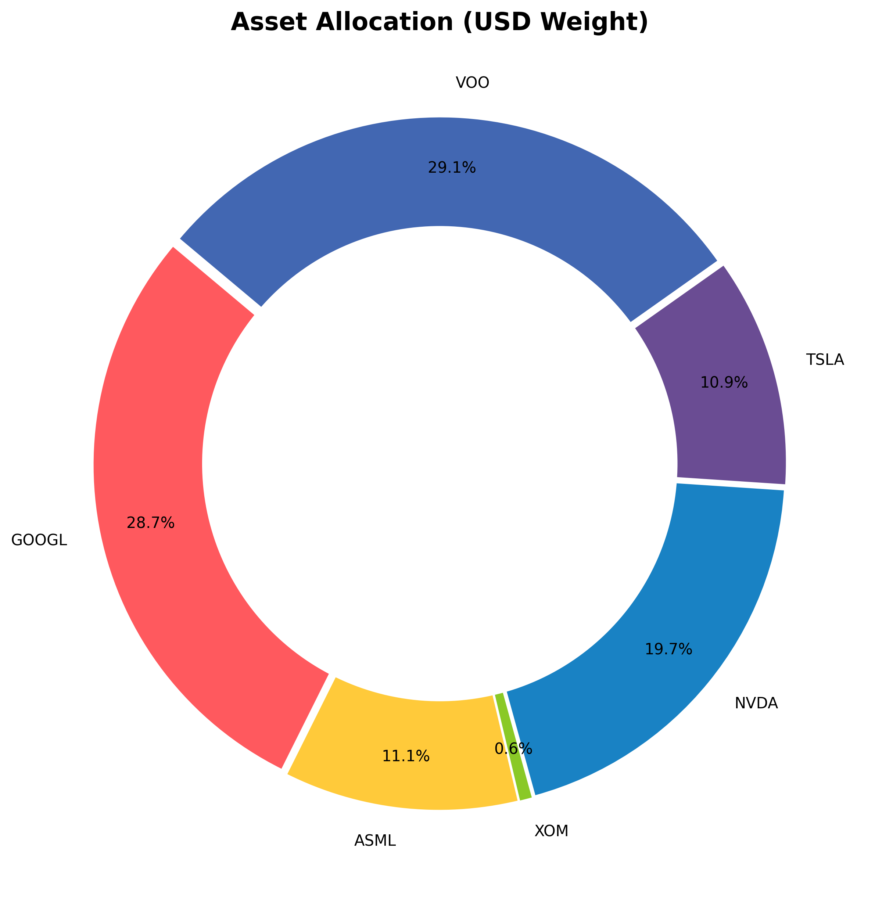

# 📊 Portfolio Dashboard | מעקב תיק השקעות
**Last Update:** 04/08/2026 21:41 | **USD/ILS:** ₪3.004

## 💰 Portfolio Summary | סיכום התיק
| Metric | Value | נתון |
| :--- | :--- | :--- |
| **Current Value** | `₪183,293` | **שווי נוכחי** |
| **Total Invested** | `₪128,781` | **סך השקעה** |
| **Total Profit/Loss** | `+42.33%` (₪54,512) | **רווח/הפסד כולל** |
| **Daily Change** | `+2.02%` | **שינוי יומי** |

## 📜 Holdings | פירוט החזקות
| Ticker | Shares | Avg. Cost | Current Price | P&L % | P&L ILS |
| :--- | :--- | :--- | :--- | :--- | :--- |
| GOOGL | 48 | $187.99 | $379.41 | 🟢 +101.82% | ₪27,600 |
| ASML | 4 | $934.51 | $1,703.77 | 🟢 +82.32% | ₪9,243 |
| XOM | 2 | $126.08 | $154.74 | 🟢 +22.73% | ₪172 |
| NVDA | 57 | $148.62 | $212.50 | 🟢 +42.98% | ₪10,938 |
| TSLA | 20 | $436.45 | $327.22 | 🔴 -25.03% | ₪-6,562 |
| VOO | 24 | $527.38 | $709.38 | 🟢 +34.51% | ₪13,121 |

## 📈 Charts | גרפים

---
📂 *Created by Almog787*